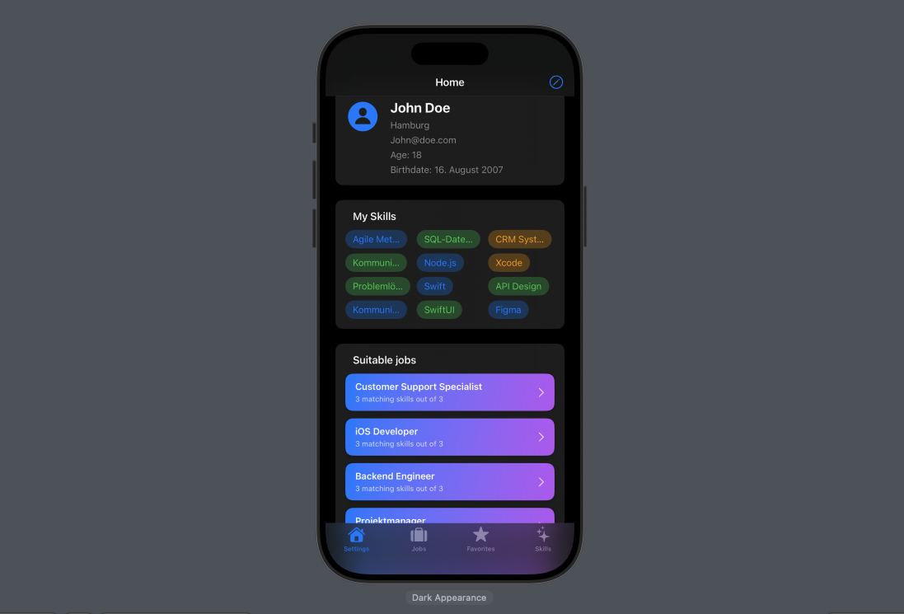

# DreamJobs

This SwiftUI app helps you collect and persist personal information about job preferences and skills. It supports you in keeping track of your career goals and developing your skills strategically. 💻

## Features

- ✅ Record personal job preferences  
- ✅ Manage skills and competencies  
- ✅ Persistent data storage using **SwiftData**  
- ✅ Use of **UserDefaults** for user-specific values  
- ✅ Clear overview of all entries  
- ✅ Ability to edit and delete entries  
- ✅ Intuitive navigation with **NavigationStack** and **NavigationLink**  

## Technologies

- SwiftUI  
- SwiftData for persistent data storage  
- UserDefaults for small user-specific values  
- NavigationStack & NavigationLink for navigation  
- @State and @Binding for state management  
- Lists, buttons, and forms for user interaction  

## How to Run

1. Click the green **"Code"** button on this repository and select **"Open with Xcode"** (if available), or download the ZIP and open the project manually.  
2. Alternatively, open the `.xcodeproj` or `.xcworkspace` file directly in **Xcode**.  
3. Click the **Run** ▶️ button in the top toolbar to build and launch the app in the iOS Simulator or on a physical device.  
4. Use the app to track meals and drinks, add new entries, view details, and delete entries.

---

📝 Disclaimer

This project was developed as part of my training. The source code, structure and documentation are my own work.

© 2025 Jeff Braun. All rights reserved. Licensed under the [MIT License](./LICENSE).
